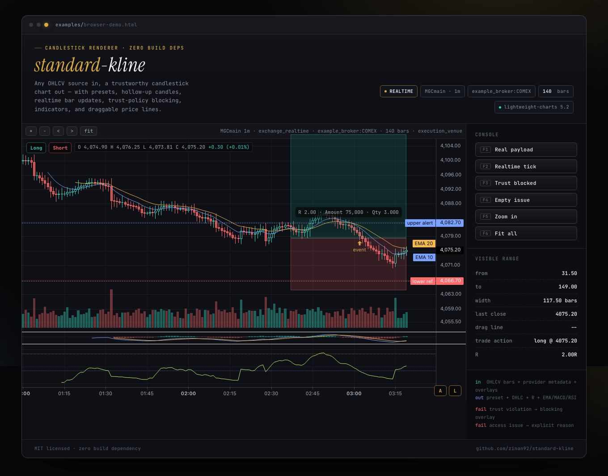
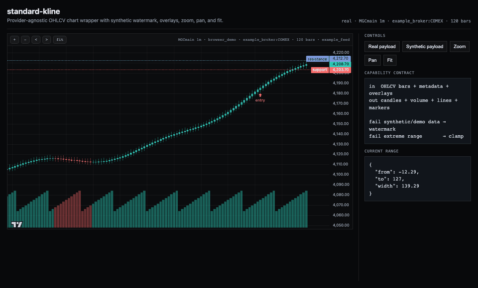

<div align="center">

# standard-kline

**把任意 OHLCV 数据源渲染成可信 K 线图的标准前端组件。**

[](standard-kline.js)
[](https://github.com/tradingview/lightweight-charts)
[](https://github.com/zinan92/standard-kline/actions/workflows/ci.yml)
[](standard-kline.test.js)
[](LICENSE)

</div>

---

```text
in  OHLCV bars + provider/source/trust metadata + preset/theme/indicator config + optional overlay arrays
out standardized candlestick chart + volume histogram + EMA/MACD/RSI + price lines + markers + trust overlay

fail missing LightweightCharts → visible "chart library missing" overlay
fail invalid/missing OHLC rows  → drop bad rows instead of crashing
fail empty payload             → visible access_issues / reject_reason overlay
fail trust-policy violation    → visible blocking overlay + reject reasons
fail synthetic/demo data       → visible watermark unless policy blocks it
fail extreme zoom/pan range    → clamp to data window + buffer
```

`standard-kline` 是一个小型、无构建依赖的 K 线图包。它不关心你的数据来自哪个交易所、券商 API、回测文件，还是未来别的数据源；只要输入能整理成统一 OHLCV bars，就能稳定渲染、缩放、平移、复位、增量更新，并把真实数据和 synthetic/cache/research-only 等不可信状态明确拦出来。

## 示例输出

真实浏览器 demo，包含 preset、hollow-up candlestick、OHLC header、time axis、volume、EMA/MACD/RSI、左上角 Long/Short action buttons、risk/reward R overlay、draggable price line、marker、toolbar zoom/pan/fit、A/L scale controls、realtime last-bar update，以及 trust-policy blocking overlay。





本地打开 demo：

```bash
npm install
npx playwright install chromium
npm run capture-demo
```

`npm run capture-demo` 会重新打开 [examples/browser-demo.html](examples/browser-demo.html)，生成 `docs/assets/standard-kline-demo.png` 和 `docs/assets/standard-kline-demo.gif`。

## 适用场景

- 交易 dashboard 需要复用同一套 K 线组件。
- 多个行情源已经在后端标准化成 OHLCV bars。
- 前端需要显示 provider、source mode、quality flags，避免把 placeholder 当真实价格。
- 应用有自己的业务概念，例如 trade plan、fills、alerts，但不想把这些概念写进图表包。

## 安装

### Browser UMD

```html
<script src="lightweight-charts.standalone.production.js"></script>
<script src="standard-kline.js"></script>

<div id="chart" style="height: 420px"></div>

<script>
  const chart = new StandardKline.StandardKlineChart(
    document.getElementById("chart"),
    { height: 420, showVolume: true }
  );
</script>
```

### Node / Bundler

```bash
npm install github:zinan92/standard-kline
npm install lightweight-charts
```

这个仓库当前还没有发布到 npm。直接从 GitHub 安装私有仓库时，调用方需要有对应 GitHub 访问权限。

```js
const {
  StandardKlineChart,
  adaptBarPayload,
  nearestTime,
} = require("standard-kline");
```

`lightweight-charts` 是 peer dependency。浏览器直引时，请确保 `window.LightweightCharts` 在创建图表前已经加载。

## 输入契约

```js
{
  schema_version: "ohlcv-v1",
  status: "ready",
  source_mode: "rest_poll",
  symbol: "BTCUSD",
  timeframe: "1m",
  provider: "example_exchange",
  quality_flags: [],
  is_synthetic: false,
  served_from: "upstream",
  fresh: true,
  age_seconds: 8,
  max_age_seconds: 90,
  bars: [
    {
      timestamp: "2026-01-01T00:00:00Z",
      open: 100,
      high: 102,
      low: 99,
      close: 101,
      volume: 5,
      provider: "example_exchange",
      quality_flags: [],
    },
  ],
}
```

每根 bar 只强制要求 `timestamp/open/high/low/close`。`timestamp` 支持 ISO UTC 字符串、epoch seconds、epoch milliseconds。坏行会被跳过，不会让整张图崩掉；`meta.rejected_rows` 会记录被丢弃的数量。空 payload 可以带 `access_issues` / `reject_reason`，overlay 会显示具体原因。

## Datafeed / Adapter Boundary

这个包**不内置任何具体交易所/券商请求**。把某个数据源字段映射成本包的 OHLCV payload，是调用方（应用层）的事。一个通用图表库不应该认识 Binance、Tiger、DualTrack、order/fills 或任何具体业务来源。

[examples/adapters/generic-ohlcv.js](examples/adapters/generic-ohlcv.js) 是一个通用示例，演示如何把已经接近标准的 OHLCV rows 补齐成合法 payload：补上 `schema_version`/`provider`/`source_mode`/`timeframe`，保留每行的 `quality_flags`。你自己的数据源 adapter 照着输出同样的 payload 形状即可，代码住在你的应用里，不进这个包。

如果你的后端使用 `zinan92/datafeed` / `kline` 风格的 `CandleResponse`，可以用本包的纯函数直接适配 envelope：

```js
const adapted = StandardKline.adaptDatafeedResponse(candleResponse, {
  trustPolicy: {
    requireFresh: true,
    allowSynthetic: false,
    allowCache: false,
    forbiddenQualityFlags: ["research_only", "not_execution_venue"],
    allowedSourceModes: ["exchange_realtime"],
  },
});
```

映射规则：

- `candles` -> chart `bars`
- `ticker/symbol/timeframe/provider/source_mode` -> chart meta
- `served_from/fresh/is_synthetic/quality_flags/age_seconds/max_age_seconds` 保留到 meta
- trust policy 在适配后统一评估，不在业务页面散落判断

验证这个示例：

```bash
node --test examples/adapters/adapter-examples.test.js
```

## 架构

```text
raw source rows
      │
      ▼
your adapter / adaptDatafeedResponse()
      │  emits standard OHLCV payload + trust metadata
      ▼
adaptBarPayload()
      │  candles + volumes + metadata + trust state
      ▼
StandardKlineChart
      │
      ├─ candlestick series
      ├─ volume histogram
      ├─ EMA / MACD / RSI indicators
      ├─ generic priceLines / markers
      └─ realtime update / trust overlay / zoom / pan / fit / resize
```

## Presets

`standard-kline` 内置五个尺寸/布局 preset，供 Agent 或业务页面直接选择：

| Preset | 用途 | 默认行为 |
|---|---|---|
| `large` | 主交易图 | 大画布、toolbar、volume、较宽 bar spacing |
| `medium` | dashboard 面板 | 中等高度、标准交互 |
| `small` | 卡片图 | 紧凑高度、保留 toolbar 和 volume |
| `inset` | 图中图 / 上下文小图 | 隐藏 toolbar、默认不显示 volume |
| `responsive` | 默认接入 | 跟随容器，标准 toolbar/volume/交互 |

```js
const options = StandardKline.createStandardKlineOptions({
  preset: "large",
});
```

如果 Agent 部署时用户没有特殊要求，使用：

```js
const options = StandardKline.defaultAgentDeploymentOptions();
```

这个默认配置等价于：`preset:"responsive"`、绿涨红跌、涨空心、跌实心、不开默认指标。

## Standard Visual Rules

默认标准：

- X 轴 / 时间轴一定显示
- 拖拽、滚轮缩放、pinch、fit 走统一实现
- 顶部显示当前 bar 的 OHLC 和 movement
- 右下角 `A` 控制 auto fit，`L` 控制 log scale
- 绿涨红跌
- 上涨 candle 中空
- 下跌 candle 实心

也可以切换成红涨绿跌：

```js
new StandardKline.StandardKlineChart("#chart", {
  candleDirection: "red-up-green-down",
});
```

## 基本用法

```js
const chart = new StandardKline.StandardKlineChart("#chart", {
  preset: "responsive",
  candleDirection: "green-up-red-down",
  trustPolicy: {
    requireFresh: true,
    allowSynthetic: false,
    allowCache: false,
    forbiddenQualityFlags: ["research_only", "not_execution_venue"],
    allowedSourceModes: ["exchange_realtime"],
  },
  indicators: {
    ema: [
      { period: 10, color: "#7aa2ff" },
      { period: 20, color: "#f5b84b" },
    ],
    macd: true,
    rsi: { period: 14 },
  },
  onPriceLineChange({ id, price }) {
    console.log(id, price);
  },
  onTradeAction({ side, price }) {
    console.log(side, price);
  },
});

chart.setPayload(payload, {
  priceLines: [
    {
      id: "alert-1",
      price: 4200,
      title: "alert",
      color: "#7aa2ff",
      lineStyle: "dashed",
      lineWidth: 1,
      draggable: true,
    },
  ],
  riskReward: {
    side: "long",
    entry: 4193,
    stop: 4183,
    target: 4213,
    amount: 75000,
    quantity: 3,
  },
  markers: [
    {
      time: 1783213260,
      position: "belowBar",
      color: "#7aa2ff",
      shape: "arrowUp",
      text: "entry 4180.0",
    },
  ],
  fit: true,
});

// WebSocket / SSE / polling update path:
chart.updateBar({ timestamp: 1783213320, open: 4190, high: 4195, low: 4188, close: 4193, volume: 22 });
chart.appendBars(nextBars);
chart.replaceBars(nextPayload);

chart.zoom(0.72); // < 1 zoom in, > 1 zoom out
chart.pan(12);    // shift by logical bars
chart.fit();      // show the full safe data window
```

## Overlay 设计

这个包只认识通用 overlay：

- `priceLines`: `{ id, price, title, color, lineStyle, lineWidth, draggable }[]`
- `markers`: Lightweight Charts marker objects

它不会内置 trade plan、fill、human/machine track、strategy signal 等业务模型。调用方应该在自己的应用层把业务对象转成 `priceLines` 和 `markers`，再传给图表。

如果 marker 的时间戳不一定刚好落在 candle 上，可以先用 `nearestTime`：

```js
const markerTime = StandardKline.nearestTime(adapted.candles, fill.timestamp);
```

## TrustPolicy

`TrustPolicy` 是通用信任门槛，不是交易策略。它只回答“这份 payload 能不能作为可信行情画成 ready 图”。

```js
const trustPolicy = {
  requireFresh: true,
  allowSynthetic: false,
  allowCache: false,
  forbiddenQualityFlags: ["research_only", "not_execution_venue"],
  allowedSourceModes: ["exchange_realtime"],
};

chart.setTrustPolicy(trustPolicy);
const state = chart.getTrustState();
```

当 payload 不满足 policy：

- chart overlay 进入 `data-state="blocked"`
- overlay 显示具体 reject reasons
- `chart.getTrustState()` 暴露 `{ trusted, blocked, reasons, policy, meta }`
- overlay 会拦住图表交互，避免 blocked 数据被误当成 ready/tradable 图

## Realtime Updates

`setPayload(payload, overlays?)` 适合初始化或全量替换。实时 bar 更新用：

- `updateBar(bar)`：同时间戳则替换最后一根；新时间戳则追加
- `appendBars(bars)`：批量增量合并
- `replaceBars(payload, overlays?)`：显式全量替换

主 candlestick/volume series 对最后一根更新使用 Lightweight Charts 的 `series.update()`；只有历史插入或乱序替换才回退到 `setData()`。

## Indicators

指标只负责渲染，不输出任何交易判断：

```js
new StandardKlineChart("#chart", {
  indicators: {
    ema: [
      { period: 10, color: "#7aa2ff" },
      { period: 20, color: "#f5b84b" },
    ],
    macd: { fastPeriod: 12, slowPeriod: 26, signalPeriod: 9 },
    rsi: { period: 14 },
  },
});
```

EMA 渲染在主图；MACD 和 RSI 渲染在下方 pane。默认不强行打开任何指标，调用方按页面场景选择。MACD/RSI 的 pane 只显示线条、柱状图和必要刻度，不显示额外 series 标题或 RSI high/low 轴标签，避免看盘界面变乱。

简写也支持：

```js
indicators: {
  ema: [10, 20],
  macd: true,
  rsi: true,
}
```

## Agent Deployment Contract

当 Agent 帮用户部署 K 线图时，先问一句：

```text
你要大图、小图、图中图，还是自适应？
```

映射关系：

- 大图 -> `preset:"large"`
- 小图 -> `preset:"small"`
- 图中图 -> `preset:"inset"`
- 自适应 / 默认 -> `preset:"responsive"`

如果用户所有设置都选择默认，Agent 直接使用：

```js
const chart = new StandardKline.StandardKlineChart(container, {
  ...StandardKline.defaultAgentDeploymentOptions(),
  trustPolicy,
});
```

不要每次重新设计 K 线图；先复用标准 preset，再按用户要求增加指标或切换红涨绿跌。

## Draggable Price Lines

调用方可以把任意价格线标成 `draggable`，拖动后通过通用回调拿到 `{ id, price }`：

```js
chart.setPayload(payload, {
  priceLines: [
    { id: "line-a", price: 4200, title: "line A", draggable: true },
  ],
});
```

`standard-kline` 不理解 TP/SL、entry、alert 等语义。调用方自己命名、自己解释 `id`。

## Trade Actions And R

`standard-kline` 可以在图表左上角显示通用 Long / Short action buttons，但它们不是下单按钮。组件只触发回调：

```js
new StandardKlineChart("#chart", {
  showTradeControls: true,
  onTradeAction({ side, price, bar, meta, trustState }) {
    // caller decides whether this opens a ticket, fills an order form,
    // or only records a chart-side intent.
  },
});
```

Risk/reward overlay 也是通用绘图辅助层。调用方传 `entry/stop/target`，组件显示 reward/risk 区并计算 R：

```js
chart.setPayload(payload, {
  riskReward: {
    side: "long",
    entry: 100,
    stop: 95,
    target: 115,
    amount: 75000,
    quantity: 3,
  },
});
```

`R = abs(target - entry) / abs(entry - stop)`。这不等同于策略判断，也不代表下单建议。

## Scale Controls

右下角标准控件：

- `A`: toggle auto fit。打开时调用 `fit()` 并保持后续实时更新自动回到完整数据窗口。
- `L`: toggle log scale。内部使用 Lightweight Charts `PriceScaleMode.Logarithmic`。

也可以用 API：

```js
chart.setAutoFit(true);
chart.setLogScale(true);
```

## Synthetic / Demo 数据

默认 synthetic 判定只看通用信号：

- `payload.is_synthetic === true`
- `provider` 包含 `"synthetic"`
- `source_mode` 包含 `"synthetic"`

如果你的系统用自己的 `quality_flags` 标记 demo/seed/display-only 数据，在构造图表或调用 adapter 时显式传入：

```js
const syntheticFlags = ["synthetic_seed", "display_only", "not_for_trading_signal"];

const chart = new StandardKline.StandardKlineChart("#chart", {
  syntheticFlags,
});

const adapted = StandardKline.adaptBarPayload(payload, { syntheticFlags });
```

被判定为 synthetic 的 payload 会显示明显水印，避免被误认为真实交易价格。如果同时传入 `trustPolicy.allowSynthetic: false`，它会升级为 blocking overlay。

## API

### `new StandardKlineChart(container, options?)`

| Option | Default | Description |
|---|---:|---|
| `preset` | `responsive` | `large` / `medium` / `small` / `inset` / `responsive` |
| `height` | `380` | 初始高度；实际会跟随容器 resize |
| `minHeight` | preset | 最小图表高度 |
| `compact` | `false` | 更紧凑的默认高度和 bar spacing |
| `showToolbar` | `true` | 是否显示 zoom/pan/fit toolbar |
| `showOhlcHeader` | preset | 是否显示顶部 OHLC/movement header |
| `showScaleControls` | preset | 是否显示右下角 `A` / `L` 控件 |
| `showTradeControls` | `false` | 是否显示 Long / Short action buttons |
| `showVolume` | `true` | 是否显示 volume histogram |
| `candleDirection` | `green-up-red-down` | `green-up-red-down` 或 `red-up-green-down` |
| `hollowUp` | `true` | 上涨 candle 是否中空 |
| `filledDown` | `true` | 下跌 candle 是否实心 |
| `textColor` | theme | chart text color |
| `gridColor` | theme | grid line color |
| `syntheticFlags` | `[]` | 额外 synthetic quality flags |
| `trustPolicy` | `null` | 通用信任门槛，违反时显示 blocking overlay |
| `indicators` | `{}` | `{ ema: [...], macd: true | {...}, rsi: true | {...} }` |
| `onPriceLineChange` | `null` | 拖动 price line 后回调 `{ id, price }` |
| `onTradeAction` | `null` | Long / Short action 回调 |
| `logicalRangeBufferBars` | `max(8, 12% bars)` | 允许 pan/zoom 超出数据的 buffer |
| `minVisibleBars` | `6` | 最小可见 bar 数 |
| `maxBarSpacing` | `80` | 最大水平 zoom |

### Chart methods

- `setPayload(payload, overlays?)`
- `setAdaptedData(adapted, overlays?)`
- `updateBar(bar)`
- `appendBars(bars)`
- `replaceBars(payload, overlays?)`
- `getTrustState()`
- `setTrustPolicy(policy)`
- `setAutoFit(enabled)`
- `setLogScale(enabled)`
- `setLoading(loading, message?)`
- `zoom(factor)`
- `pan(bars)`
- `fit()`
- `destroy()`

### Pure helpers

- `adaptBarPayload(payload, options?)`
- `adaptDatafeedResponse(candleResponse, options?)`
- `createStandardKlineOptions(options?)`
- `defaultAgentDeploymentOptions()`
- `getPresetConfig(preset)`
- `normalizeCandleTheme(options?)`
- `evaluateTrustPolicy(meta, trustPolicy?)`
- `mergeBarIntoAdaptedData(adapted, bar, options?)`
- `calculateEmaData(candles, period)`
- `calculateMacdData(candles, options?)`
- `calculateRiskReward(riskReward)`
- `calculateRsiData(candles, period?)`
- `isSyntheticMeta(meta, syntheticFlags?)`
- `clampLogicalRange(range, barCount, options?)`
- `nearestTime(candles, timestamp)`
- `normalizeQualityFlags(value)`
- `toEpochSeconds(value)`

## 失败行为

| Failure | Behavior |
|---|---|
| `window.LightweightCharts` 未加载 | 显示 chart-library-missing overlay |
| payload 无有效 bars | 显示 no-kline-data overlay，并优先展示 `access_issues` / `reject_reason` |
| 单行缺少 OHLC 或 timestamp | 跳过该行 |
| synthetic/demo 数据 | 显示 not-real-price watermark；若 policy 禁止则 blocked |
| `served_from="cache"` 且 `allowCache=false` | 显示 trust-policy-blocked overlay |
| `fresh !== true` 且 `requireFresh=true` | 显示 trust-policy-blocked overlay |
| 命中 `forbiddenQualityFlags` | 显示 trust-policy-blocked overlay |
| `setVisibleLogicalRange({ from: -999, to: 999 })` | clamp 到数据窗口 + buffer |

## Attribution

组件创建 Lightweight Charts 时设置 `layout.attributionLogo=false`，避免内置 attribution 文本/标识泄漏到交易画布里。调用方仍应在自己的页面或产品文档中按 Lightweight Charts 的 NOTICE/许可证要求提供 TradingView attribution/link。

## 测试

```bash
npm test
```

或直接运行：

```bash
node --test standard-kline.test.js
```

当前测试覆盖 preset/theme defaults、RSI、risk/reward R、adapter、datafeed response mapping、trust policy、bad rows、synthetic/cache blocking、realtime bar merge、timestamp conversion、range clamp、nearest candle snapping。浏览器 demo 通过 Playwright 验证 preset、OHLC header、左上角 Long/Short action buttons、A/L controls、Long action callback、risk/reward overlay、time axis、volume、EMA/MACD/RSI、MACD/RSI 标题隐藏、realtime update、blocking overlay、draggable price line 回调和 attribution 文本泄漏。

## For AI Agents

```yaml
name: standard-kline
version: 0.1.0
capability:
  summary: Render provider-agnostic trusted OHLCV payloads into a reusable realtime candlestick chart.
  in: standard OHLCV bars + provider/source/trust metadata + preset/theme/indicator config + generic overlays
  out: standardized candlestick chart + OHLC header + volume histogram + EMA/MACD/RSI + Long/Short actions + R overlay + draggable price lines + trust state
  fail:
    - "missing LightweightCharts -> visible chart-library-missing overlay"
    - "invalid OHLC rows -> drop bad rows"
    - "empty payload -> visible access_issues/reject_reason overlay"
    - "TrustPolicy violation -> blocking overlay + reject reasons"
    - "synthetic/demo data -> watermark or TrustPolicy block"
  adapters: "no provider requests built in; adaptDatafeedResponse maps zinan92/datafeed CandleResponse only"
agent_deployment:
  ask_first: "大图 / 小图 / 图中图 / 自适应?"
  default: "defaultAgentDeploymentOptions()"
  presets: ["large", "medium", "small", "inset", "responsive"]
  visual_standard: "time axis visible, standardized drag/zoom, green-up red-down by default, hollow-up candles, filled-down candles"
entrypoints:
  browser: window.StandardKline
  commonjs: require("standard-kline")
tests:
  unit: npm test
  demo_capture: npm run capture-demo
```

## 发布状态

- 当前版本：`0.1.0`
- 模块格式：UMD + CommonJS
- peer dependency：`lightweight-charts ^5.2.0`
- license：MIT

## License

MIT. See [LICENSE](LICENSE).
